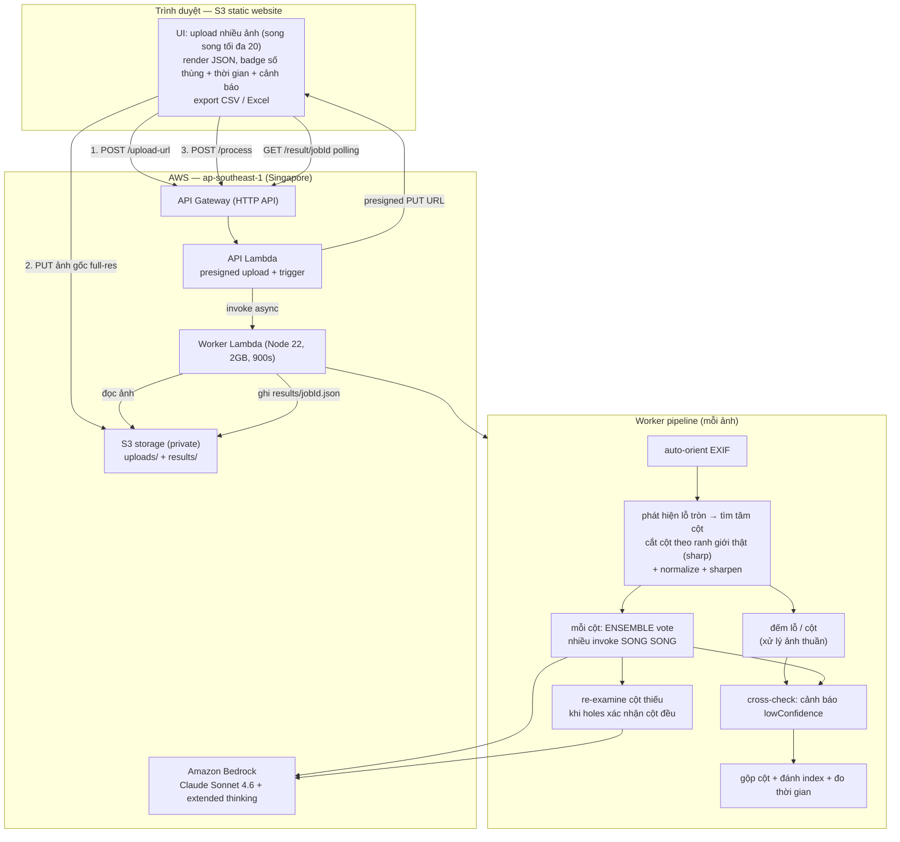

# Box Label Extractor — Claude Sonnet 4.6 (Bedrock)

Web app: upload nhiều ảnh thùng hàng → Claude Sonnet 4.6 đọc nhãn trên từng hộp →
trả về JSON theo từng ảnh, đếm số thùng (= số tem trắng), xuất CSV/Excel.

## Kiến trúc



Async + polling vì mỗi ảnh nhiều cột × nhiều vote + thinking mất ~30–150s. Nhiều ảnh
được xử lý song song (tối đa 20 cùng lúc), mỗi ảnh là một invoke độc lập (1 ảnh / lần gọi).

## Tài nguyên (region ap-southeast-1 / Singapore, profile gapv50k, account 307711587176)

| Loại | Tên |
|------|-----|
| S3 storage (private) | `gapv-label-storage-307711587176` (uploads/ + results/) |
| S3 web (public site) | `gapv-label-web-307711587176` |
| Lambda API | `gapv-label-api` (Node 22) — presigned upload + trigger |
| Lambda Worker | `gapv-label-worker` (Node 22, 2048MB, 900s) — sharp tiling + ensemble + Textract OCR + Bedrock |
| HTTP API | `gapv-label-http-api` — id `fen6lbzeah` |
| IAM roles | `gapv-label-api-role`, `gapv-label-worker-role` |
| Model | `global.anthropic.claude-sonnet-4-6` |

## URL

- **Web app:** http://gapv-label-web-307711587176.s3-website-ap-southeast-1.amazonaws.com
- **API base:** https://fen6lbzeah.execute-api.ap-southeast-1.amazonaws.com

## API (luồng presigned upload)

- `POST /upload-url` body `{ filename, mediaType }` → `{ jobId, key, uploadUrl }`
- Trình duyệt `PUT uploadUrl` (ảnh gốc full-res) lên S3
- `POST /process` body `{ jobId, key, filename }` → `{ status:"processing" }`
- `GET /result/{jobId}` → `{ status, boxCount, grid, tiles, data:{ box_count, labels } }`

## JSON output (mỗi ảnh)

```json
{
  "box_count": 31,
  "line_code_summary": { "VC9-B": 5, "VC11.2-B": 3, "VC9": 16, "VC11.2": 6 },
  "labels": [
    { "index": 1, "fields": { "shop_name": "VIN-LONG BIEN", "destination": "HN-VinCom Plaza LB", "order_number": "TO-DL-26-074028", "number": "1.1", "line_code": "VC9-B", "total": "9" } }
  ]
}
```

`line_code_summary` = số thùng theo từng loại VC (gom theo `line_code`), hiển thị thành
chip trên UI và đưa vào CSV (mục `line_code,count`) + Excel (cột riêng mỗi loại ở sheet Summary).
Tên khối JSON trên UI = tên file ảnh đã bỏ đuôi (vd `IMG_5816.json`).

## Tính năng UI

- Upload nhiều ảnh (chọn / kéo-thả), xử lý tuần tự.
- Mỗi ảnh 1 card: thumbnail, tên `*.json`, số thùng, JSON tô màu.
- **Tải CSV** từng ảnh (tên = tên ảnh, BOM UTF-8 cho tiếng Việt).
- **Tải tất cả (Excel)**: 1 file `box_labels_all.xlsx`, mỗi ảnh 1 sheet + sheet `Summary`.

## Đếm chính xác — pipeline nhiều tín hiệu

Sự thật quan trọng: Claude (cả web LẪN API) đều **tự thu nhỏ ảnh về ~1568px / 1.15 MP**
trước khi model nhìn — KHÔNG có pipeline bí mật nào ở Claude web. Để đếm chính xác phải
tự tiền xử lý + kết hợp nhiều tín hiệu phía mình:

1. **Upload full-res qua presigned S3 URL** — PUT thẳng ảnh gốc, không nén, không vướng
   giới hạn 6MB của API Gateway/Lambda.
2. **Auto-orient theo EXIF** — ảnh điện thoại thường orientation=6 (xoay 90°); không sửa
   thì cắt sai chiều (bug ngầm làm số dao động).
3. **Cắt ảnh thành cột theo VỊ TRÍ LỖ TRÒN** — không cắt mù 1/N. Thùng thường xếp lệch,
   nên cắt 1/3 cứng dễ làm 1 tile "ăn" sang 2 cột → đếm gấp đôi. Worker phát hiện lỗ tròn,
   phân cụm toạ độ X của chúng để tìm **tâm các cột thật**, rồi cắt ở khoảng giữa các cụm
   (fallback về chia đều khi tín hiệu lỗ quá yếu). Mỗi cột ~1500px, được Claude cấp trọn
   1568px. Tiền xử lý: normalize + sharpen cho nét chữ.
4. **Prompt đếm theo TẦNG thùng + mỏ neo lỗ tròn**: coi mỗi lớp xếp chồng = 1 thùng, dùng
   lỗ tròn (vòng tối) để định vị từng tầng (nhiều lỗ vẫn 1 thùng); thùng có nhãn mờ vẫn
   đếm (không bịa chữ); 1 thùng nhiều nhãn → lấy nhãn lớn nhất, đếm 1; hộp khác màu đếm
   bằng nhãn. KHÔNG đếm chữ in trên bìa (VC9...), tem nhỏ/rách.
5. **Extended thinking** mỗi cột — đếm vật thể dày đặc cần suy luận từng bước (đo được:
   28 → 34). Thinking ~16k là điểm tối ưu; max 64k không tốt hơn mà chậm gấp ~2.5×.
6. **Ensemble vote (song song)**: mỗi cột chạy `VOTES` lần, TẤT CẢ lời gọi (mọi cột × mọi
   vote) fire cùng lúc, rồi majority-vote số mỗi cột → khử dao động ngẫu nhiên. Latency
   ≈ 1 lời gọi.
7. **Amazon Textract OCR (hybrid)**: mỗi cột được Textract đọc text thô (chính xác ký tự
   hơn LLM trên nhãn in dày) → đưa danh sách dòng cho Claude làm "OCR reference" để điền
   field VALUES chuẩn (order_number bắt đầu "TO-", mã "VC9-B", địa chỉ có dấu phẩy). Textract
   KHÔNG đụng tới việc đếm thùng — chỉ giúp đọc chữ.
8. **Hole-detector cross-check (tham khảo)**: thuật toán xử lý ảnh thuần phát hiện lỗ tròn
   (ngưỡng thích ứng theo độ sáng + morphological closing để lấp vật trong lỗ + kiểm tra
   độ-tròn). Chỉ **cảnh báo** `lowConfidence` khi số lỗ NHIỀU HƠN hẳn số model đếm (nghi
   model sót) — KHÔNG bao giờ tự sửa số.

Quy tắc field: order_number prefix "TO-"; place có dấu phẩy = `destination` (địa chỉ đầy đủ),
không phẩy = `shop_name`; `box_code` = mã in trên thùng carton (tin cậy hơn line_code trên nhãn).

Kết quả kiểm chứng (6 ảnh, so với ground-truth): 4/6 đúng tuyệt đối, 2 ảnh dày ~45 thùng
lệch 2-4 (thùng chồng sát, chụp nghiêng — giới hạn vật lý). UI hiện badge ⚠ khi lowConfidence.

Tham số env của `gapv-label-worker`:
`MODEL_ID`, `THINKING_BUDGET` (16000), `MAX_TOKENS` (48000), `TILE_TARGET_PX` (1500),
`VOTES` (3), `CROSSCHECK_TOL` (0.2).

## Cập nhật lại (redeploy)

```powershell
cd app/deploy
./redeploy.ps1
```

## Ghi chú về model
- Yêu cầu ban đầu là **Claude Opus 4.8** nhưng account `307711587176` chưa duyệt agreement
  4.8 (Private Marketplace chặn — IAM user không có quyền subscribe). Opus 4.7 và GPT-5.5
  cũng chưa duyệt (đã test thật, đều `access_denied`).
- **Sonnet 4.6** (`global.anthropic.claude-sonnet-4-6`) dùng được ngay, không cần duyệt.
  Cùng trần ảnh 1.15MP như Opus 4.6 nên vẫn cần tiling + thinking để đạt độ chính xác.
- Nếu sau này enable được Opus 4.7 (trần 3.75MP, gấp ~3 lần): có thể giảm số cột tiling.
  Đổi `MODEL_ID` trong env worker + `app/frontend/config.js` rồi chạy `redeploy.ps1`.
