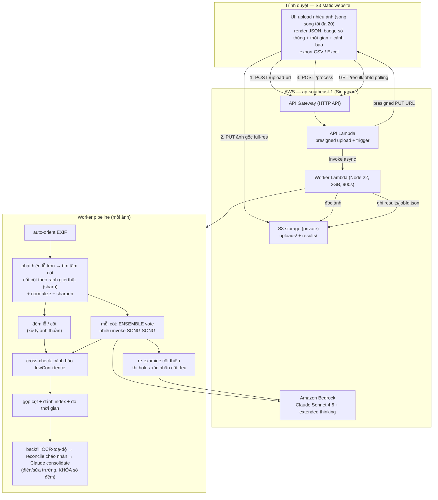

# Box Label Extractor — Claude Sonnet 4.6 (Bedrock)

Web app: upload nhiều ảnh thùng hàng → Claude Sonnet 4.6 đọc nhãn trên từng hộp →
trả về JSON theo từng ảnh, đếm số thùng (= số tem trắng), xuất CSV/Excel.

## Kiến trúc



Async + polling vì mỗi ảnh nhiều cột × nhiều vote + thinking mất ~30–150s. Nhiều ảnh
được xử lý song song (tối đa 20 cùng lúc), mỗi ảnh là một invoke độc lập (1 ảnh / lần gọi).

## Tài nguyên (region ap-southeast-1 / Singapore, profile gapv50k, account 307711587176)

| Loại | Tên |
|------|-----|
| S3 storage (private) | `gapv-label-storage-307711587176` (uploads/ + results/) |
| S3 web (public site) | `gapv-label-web-307711587176` |
| Lambda API | `gapv-label-api` (Node 22) — presigned upload + trigger |
| Lambda Worker | `gapv-label-worker` (Node 22, 2048MB, 900s) — tiling + ensemble đếm + Textract OCR + backfill/reconcile/consolidate trường |
| HTTP API | `gapv-label-http-api` — id `fen6lbzeah` |
| IAM roles | `gapv-label-api-role`, `gapv-label-worker-role` |
| Model | `global.anthropic.claude-sonnet-4-6` |

## URL

- **Web app:** http://gapv-label-web-307711587176.s3-website-ap-southeast-1.amazonaws.com
- **API base:** https://fen6lbzeah.execute-api.ap-southeast-1.amazonaws.com

## API (luồng presigned upload)

- `POST /upload-url` body `{ filename, mediaType }` → `{ jobId, key, uploadUrl }`
- Trình duyệt `PUT uploadUrl` (ảnh gốc full-res) lên S3
- `POST /process` body `{ jobId, key, filename }` → `{ status:"processing" }`
- `GET /result/{jobId}` → `{ status, boxCount, grid, tiles, data:{ box_count, labels } }`

## JSON output (mỗi ảnh)

```json
{
  "box_count": 31,
  "line_code_summary": { "VC9-B": 5, "VC11.2-B": 3, "VC9": 16, "VC11.2": 6 },
  "labels": [
    { "index": 1, "fields": { "shop_name": "VIN-LONG BIEN", "destination": "HN-VinCom Plaza LB", "order_number": "TO-DL-26-074028", "number": "1.1", "line_code": "VC9-B", "total": "9" } }
  ]
}
```

`line_code_summary` = số thùng theo từng loại VC (gom theo `line_code`), hiển thị thành
chip trên UI và đưa vào CSV (mục `line_code,count`) + Excel (cột riêng mỗi loại ở sheet Summary).
Tên khối JSON trên UI = tên file ảnh đã bỏ đuôi (vd `IMG_5816.json`).

## Tính năng UI

- Upload nhiều ảnh (chọn / kéo-thả), xử lý tuần tự.
- Mỗi ảnh 1 card: thumbnail, tên `*.json`, số thùng, JSON tô màu.
- **Tải CSV** từng ảnh (tên = tên ảnh, BOM UTF-8 cho tiếng Việt).
- **Tải tất cả (Excel)**: 1 file `box_labels_all.xlsx`, mỗi ảnh 1 sheet + sheet `Summary`.

## Đếm chính xác — pipeline nhiều tín hiệu

Sự thật quan trọng: Claude (cả web LẪN API) đều **tự thu nhỏ ảnh về ~1568px / 1.15 MP**
trước khi model nhìn — KHÔNG có pipeline bí mật nào ở Claude web. Để đếm chính xác phải
tự tiền xử lý + kết hợp nhiều tín hiệu phía mình:

1. **Upload full-res qua presigned S3 URL** — PUT thẳng ảnh gốc, không nén, không vướng
   giới hạn 6MB của API Gateway/Lambda.
2. **Auto-orient theo EXIF** — ảnh điện thoại thường orientation=6 (xoay 90°); không sửa
   thì cắt sai chiều (bug ngầm làm số dao động).
3. **Cắt ảnh thành cột theo VỊ TRÍ LỖ TRÒN** — không cắt mù 1/N. Thùng thường xếp lệch,
   nên cắt 1/3 cứng dễ làm 1 tile "ăn" sang 2 cột → đếm gấp đôi. Worker phát hiện lỗ tròn,
   phân cụm toạ độ X của chúng để tìm **tâm các cột thật**, rồi cắt ở khoảng giữa các cụm
   (fallback về chia đều khi tín hiệu lỗ quá yếu). Mỗi cột ~1500px, được Claude cấp trọn
   1568px. Tiền xử lý: normalize + sharpen cho nét chữ.
4. **Prompt đếm theo TẦNG thùng + mỏ neo lỗ tròn**: coi mỗi lớp xếp chồng = 1 thùng, dùng
   lỗ tròn (vòng tối) để định vị từng tầng (nhiều lỗ vẫn 1 thùng); thùng có nhãn mờ vẫn
   đếm (không bịa chữ); 1 thùng nhiều nhãn → lấy nhãn lớn nhất, đếm 1; hộp khác màu đếm
   bằng nhãn. KHÔNG đếm chữ in trên bìa (VC9...), tem nhỏ/rách.
5. **Extended thinking** mỗi cột — đếm vật thể dày đặc cần suy luận từng bước (đo được:
   28 → 34). Thinking ~16k là điểm tối ưu; max 64k không tốt hơn mà chậm gấp ~2.5×.
6. **Ensemble vote (song song)**: mỗi cột chạy `VOTES` lần, TẤT CẢ lời gọi (mọi cột × mọi
   vote) fire cùng lúc, rồi majority-vote số mỗi cột → khử dao động ngẫu nhiên. Latency
   ≈ 1 lời gọi.
7. **Amazon Textract OCR (hybrid)**: mỗi cột được Textract đọc text thô (chính xác ký tự
   hơn LLM trên nhãn in dày) → đưa danh sách dòng cho Claude làm "OCR reference" để điền
   field VALUES chuẩn (order_number bắt đầu "TO-", mã "VC9-B", địa chỉ có dấu phẩy). Textract
   KHÔNG đụng tới việc đếm thùng — chỉ giúp đọc chữ.
8. **Hole-detector cross-check (tham khảo)**: thuật toán xử lý ảnh thuần phát hiện lỗ tròn
   (ngưỡng thích ứng theo độ sáng + morphological closing để lấp vật trong lỗ + kiểm tra
   độ-tròn). Chỉ **cảnh báo** `lowConfidence` khi số lỗ NHIỀU HƠN hẳn số model đếm (nghi
   model sót) — KHÔNG bao giờ tự sửa số.

Quy tắc field: order_number prefix "TO-"; place có dấu phẩy = `destination` (địa chỉ đầy đủ),
không phẩy = `shop_name`; `box_code` = mã in trên thùng carton (tin cậy hơn line_code trên nhãn).

### Đọc trường ĐẦY ĐỦ + CHÍNH XÁC (pipeline field, sau khi đã đếm)

Claude vừa đếm vừa đọc trên cột thu nhỏ ~1568px nên hay bỏ sót chữ nhỏ (order/time/total).
Sau khi chốt số thùng, có 3 pha bồi trường — KHÔNG pha nào được đổi số đếm:

9. **Backfill theo toạ độ OCR** (`backfill.mjs`, deterministic, 0 model): chia mỗi cột thành
   N băng theo số thùng, điền order_number/time/total còn trống từ token Textract rơi đúng băng
   ("TO-…" → order, "TOTAL n" → total, "HH:MM:SS" → time). Chỉ điền chỗ trống.
10. **Reconcile chéo nhãn** (`reconcile.mjs`, deterministic, 0 model): trong 1 ảnh = 1 đợt giao,
    cùng shop_name → cùng order_number (HN-RETAIL ↔ 074117…). Điền order/box_code từ consensus
    của lô; suy `line_code = box_code + hậu tố` (học hậu tố "-B" từ chính lô). Đây là kiểu suy
    luận pattern mà con người dùng khi nhãn mờ.
11. **Claude consolidate** (1 lời gọi text-only/ảnh): đưa toàn bộ nhãn + toàn bộ OCR cho Claude
    sửa/điền theo pattern toàn lô (sửa chữ số OCR nhiễu theo anh em, điền trường còn thiếu).
    **Khóa số nhãn** — kết quả bị từ chối nếu đổi số đếm, nên chỉ cải thiện trường.

### Kết quả kiểm chứng (12 ảnh, web đã deploy, chạy song song)

**Đếm thùng:** 11/12 đúng tuyệt đối, tổng sai số = 1 (z634118 lệch −1). Mỗi ảnh 95–175s
(đều < 3 phút), wall-clock 12 ảnh song song ~181s.

**Độ phủ trường (KPI applicability-aware — chỉ tính ảnh mà LOẠI nhãn có in trường đó):**

| trường | phủ | ghi chú |
|--------|----:|--------|
| box_code | 100% | |
| line_code | 100% | suy từ box_code khi mờ |
| shop_name | 99.7% | |
| number | 98.9% | |
| order_number | 86.2% | thấp ở kho SG — OCR xác nhận nhiều nhãn vốn không in / quá mờ (z505382 chỉ 9/45 có token "TO-") |
| total | 85.9% | nhiều ảnh nhãn không in total (loại n/a khỏi mẫu số) |
| products | 31/31 trên IMG_5816 | per-label OCR vớt nốt nhãn model bỏ sót |
| **OVERALL** | **95.7%** | |

KPI quan trọng: KHÔNG tính một trường lên ảnh mà loại nhãn của ảnh đó không in trường ấy
(vd nhãn VC35 xuất khẩu không có order/total) — nếu tính gộp sẽ kéo điểm xuống oan (84% → 95.7%).

**Độ chính xác giá trị (so ground-truth từng-nhãn):**
- IMG_5816 (kho HN, nhãn đầy đủ): shop_name 31/31, box_type 31/31, order_number 30/31 (~100%/100%/96.8%).
- IMG_5819 (VC35 xuất khẩu): box_type 15/15, total 15/15 (100%).

UI hiện badge ⚠ khi lowConfidence.

Tham số env của `gapv-label-worker`:
`MODEL_ID`, `THINKING_BUDGET` (10000), `MAX_TOKENS` (48000), `TILE_TARGET_PX` (1500),
`VOTES` (2), `CROSSCHECK_TOL` (0.2).

### Tinh chỉnh tốc độ ↔ chính xác (đo thật, IMG_5816, 3 lần/cấu hình)

| THINKING_BUDGET | VOTES | count đúng | avg giây | order/products |
|----------------:|------:|:--:|--:|--:|
| 16000 | 3 | — | ~204s | 31/31 |
| 12000 | 3 | 3/3 | 228s (dao động 166–267) | 31/31 |
| 8000 | 3 | 2/3 | 136s | 30.7/30.7 |
| **10000** | **2** | **3/3** | **135s (122–148)** | **31/31** |

Chốt **THINKING_BUDGET=10000 + VOTES=2**: dưới 3 phút, count ổn định 3/3, field đầy đủ như cũ.
Giảm VOTES 3→2 giúp giảm tải song song (ít throttle) nên vừa nhanh vừa ổn định hơn là chỉ hạ
budget. `time` trần ~27/31 ở mọi cấu hình là giới hạn dữ liệu (vài nhãn không in giờ), không
phải do budget. Ảnh dày 45 thùng: count 44–45 (±1), ~80s.

## Phương án thay thế: Python + OpenCV (`pyapp`)

Một dự án Python **độc lập** ở thư mục `pyapp/`: dùng **OpenCV thật** phát hiện + cắt từng
nhãn, rồi OCR bằng Textract/Bedrock (cùng Claude Sonnet 4.6). So sánh hai cách:

| | Node `app` (sharp + Bedrock) | Python `pyapp` (OpenCV + Textract/Bedrock) |
|---|---|---|
| Đếm thùng | Claude đếm theo cột (tiling + ensemble vote + thinking) — **10–11/12 đúng** | OpenCV detect nhãn (xác định, 0 chi phí model) — **3/12 exact**, tốt ảnh hi-res, yếu ảnh dày |
| Xử lý ảnh | `sharp` (xấp xỉ) | OpenCV thật (threshold sweep + contour + morphology) |
| OCR field | Bedrock + Textract hint ở mức **cột** — time ~27/31 | OCR ở mức **từng nhãn** native res — **time 30/31, order 30/31** |
| Triển khai | Lambda + API Gateway + web (online) | CLI local |

Bản Node mạnh ở **đếm thùng**; bản Python mạnh ở **đọc field từng nhãn** và không tốn model
cho khâu detect. Chi tiết + benchmark đầy đủ: [`pyapp/README.md`](pyapp/README.md).

## Cập nhật lại (redeploy)

```powershell
cd app/deploy
./redeploy.ps1
```

## Thời gian theo phase (đo thật, IMG_5816, 31 thùng, cấu hình budget=10000/VOTES=2)

| Phase | Thời gian | Chạy song song? |
|-------|----------:|----------------|
| buildTiles (orient + cắt cột theo lỗ + tiền xử lý) | ~4s | — |
| ocrColumns (Textract 3 cột) | ~6s | có (3 cột) |
| **countEnsemble (đếm + extended thinking + VOTES vote)** | **~75–90s** | có (mọi cột × mọi vote fire cùng lúc) |
| reexam (chỉ khi cột thiếu) | 0–30s | có |
| consolidate (Claude sửa/điền field theo pattern) | ~40s | 1 lời gọi |
| perLabelProducts (OCR từng nhãn còn thiếu products) | **~5s** | **có (Promise.all toàn bộ crop)** |
| **Tổng** | **~120–150s/ảnh (<3 phút)** | |

Nút thắt là **countEnsemble** — đếm thùng với thinking + ensemble vote. Per-label product OCR
chạy SONG SONG nên chỉ ~5s, không phải nguyên nhân chậm. Nhiều ảnh xử lý song song (mỗi ảnh 1
invoke độc lập), nên wall-clock 12 ảnh ≈ thời gian 1 ảnh chậm nhất.

## Lịch sử cập nhật (revisions)

### r14 — Tinh chỉnh tốc độ: budget 10000 + VOTES 2
- Hạ THINKING_BUDGET 16000→10000 và VOTES 3→2 sau khi đo trade-off 3 lần/cấu hình.
- **Kết quả:** ~204s → **~135s (<3 phút)**, count vẫn 3/3 đúng, field đầy đủ như cũ. Giảm
  VOTES giúp giảm throttle song song nên ổn định hơn là chỉ hạ budget.

### r13 — Per-label product OCR (đầy đủ products)
- **Tính năng:** với nhãn còn thiếu `products`, cắt riêng băng nhãn đó (định vị bằng Y của
  order_number) ở độ phân giải gốc và **Textract OCR từng nhãn ĐỘC LẬP** → product-code không
  bị lẫn từ nhãn liền kề (lỗi của cách gán theo cột). Lọc bỏ dòng header/shop. Tất cả crop
  chạy `Promise.all` song song.
- **Performance:** products IMG_5816 **27→31/31**; phase này chỉ +~5s.

### r12 — Backfill products theo anchor + tên sản phẩm
- Gán product rows theo Y của order_number (đầu nhãn) thay vì băng đều; bắt thêm `name`.

### r11–r9 — Consolidation + product backfill
- Pha **Claude consolidate** (1 lời gọi text-only): đưa toàn bộ nhãn + OCR cho Claude sửa/điền
  theo pattern lô, **khóa số đếm**. Backfill products deterministic từ OCR code tokens.

### r8–r6 — Backfill theo thứ tự + reconcile + suy line_code
- Backfill order/time/total: gán token OCR theo THỨ TỰ khi số token = số thùng (chính xác hơn
  băng đều) + dedup cùng hàng.
- **Reconcile chéo nhãn:** cùng shop_name → cùng order_number / box_code / destination (consensus
  lô); suy `line_code = box_code + hậu tố`. → line_code 100%, order/destination tăng mạnh.

### r5 — KPI applicability-aware
- Không tính một trường lên ảnh mà LOẠI nhãn của ảnh đó không in trường ấy (nhãn VC35 xuất khẩu
  không có order/total). KPI thật: box_code/line_code 100%, shop 99.7%, number 98.9%, tổng ~95%.

### r1–r4 — Pipeline đếm
- Tiling theo lỗ tròn + extended thinking + ensemble vote + Textract OCR hybrid. Đếm 11/12 đúng,
  tổng sai số 1.

## Ghi chú về model
- Yêu cầu ban đầu là **Claude Opus 4.8** nhưng account `307711587176` chưa duyệt agreement
  4.8 (Private Marketplace chặn — IAM user không có quyền subscribe). Opus 4.7 và GPT-5.5
  cũng chưa duyệt (đã test thật, đều `access_denied`).
- **Sonnet 4.6** (`global.anthropic.claude-sonnet-4-6`) dùng được ngay, không cần duyệt.
  Cùng trần ảnh 1.15MP như Opus 4.6 nên vẫn cần tiling + thinking để đạt độ chính xác.
- Nếu sau này enable được Opus 4.7 (trần 3.75MP, gấp ~3 lần): có thể giảm số cột tiling.
  Đổi `MODEL_ID` trong env worker + `app/frontend/config.js` rồi chạy `redeploy.ps1`.
