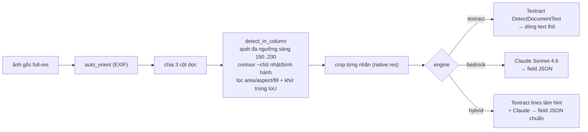

# Box Label Extractor — Python / OpenCV pipeline

Dự án Python **độc lập**: dùng **OpenCV thật** để phát hiện + cắt từng nhãn trắng trên
thùng, sau đó OCR bằng **Amazon Textract** và/hoặc **Amazon Bedrock (Claude Sonnet 4.6)**.

Khác với bản Node trong `../app` (dùng `sharp` xấp xỉ và để Claude tự đếm), bản này tách
bạch hai khâu:

- **Detect/crop = OpenCV** (xác định, không tốn tiền model, không "ảo giác").
- **OCR/đọc field = Textract / Bedrock** trên từng nhãn đã cắt ở **độ phân giải gốc**.



## Vì sao tách detect bằng OpenCV

Claude/Bedrock **tự thu nhỏ ảnh về ~1.15 MP** trước khi nhìn, nên chữ trên nhãn nhỏ bị mờ →
bỏ sót field (time, order_number...). Nếu **OpenCV cắt riêng từng nhãn** rồi mới gửi đi OCR,
mỗi nhãn được đọc ở độ phân giải gần gốc → text rõ, đọc gần như 100% trên nhãn còn nguyên.
Nhãn rách/lệch là giới hạn vật lý (mắt người cũng phải đoán).

## Cài đặt

```bash
pip install -r requirements.txt          # opencv-python, numpy, boto3
# cần AWS profile gapv50k (region ap-southeast-1) có quyền Textract + Bedrock
```

## Dùng

```bash
# OCR thô từng nhãn (nhanh)
python pipeline.py ../IMG_5816.jpeg --engine textract

# field JSON có cấu trúc cho mỗi nhãn
python pipeline.py ../IMG_5816.jpeg --engine bedrock

# tốt nhất: Textract làm hint cho Claude
python pipeline.py ../IMG_5816.jpeg --engine hybrid

# vẽ khung nhãn đã detect ra file *_annotated.jpg để soi
python pipeline.py ../IMG_5816.jpeg --engine textract --annotate
```

Output:

```json
{
  "box_count": 31,
  "labels": [
    { "index": 1, "col": 0,
      "fields": { "shop_name": "...", "order_number": "TO-...", "time": "13:32:14",
                  "line_code": "VC9-B", "total": "9", "products": [ ... ] } }
  ]
}
```

## File

| File | Vai trò |
|------|---------|
| `detector.py` | OpenCV: `auto_orient`, `detect_in_column` (quét đa ngưỡng), `detect_labels` (3 cột) |
| `ocr.py` | `textract_lines`, `bedrock_fields` (Claude Sonnet 4.6), upscale crop trước khi OCR |
| `pipeline.py` | nối detect→crop→OCR, `ThreadPoolExecutor`, CLI, `--annotate` |
| `batch_detect.py` | benchmark detection vs ground-truth (12 ảnh) |
| `eval_fields.py` | đo độ phủ field của hybrid trên 1 ảnh |
| `tune.py` | quét tham số detector |

## Hiệu năng

### Detection (OpenCV thuần, không OCR — `python batch_detect.py`)

| ảnh | thật | detect | lệch |
|-----|----:|----:|----:|
| IMG_5816.jpeg | 31 | 31 | 0 |
| IMG_5817.jpeg | 34 | 33 | −1 |
| IMG_5818.jpeg | 4 | 4 | 0 |
| IMG_5819.jpeg | 15 | 14 | −1 |
| IMG_5825.jpeg | 22 | 23 | +1 |
| z…505382 | 45 | 34 | −11 |
| z…512641 | 27 | 33 | +6 |
| z…609303 | 42 | 35 | −7 |
| z…634118 | 45 | 34 | −11 |
| z…817056 | 36 | 36 | 0 |
| z…874606 | 30 | 31 | +1 |
| z…611275 | 40 | 29 | −11 |

**exact 3/12, tổng sai số tuyệt đối 50.** Ảnh điện thoại độ phân giải cao (5712×4284) gần
như chính xác; ảnh `z*` (2560×1920) thùng xếp dày 45 cái sát nhau → nhãn dính vào nhau khi
nhị phân hoá nên under-count. ~0.2–1.2s/ảnh.

### Field coverage — engine hybrid (`python eval_fields.py ../IMG_5816.jpeg hybrid`)

31 nhãn detect được, mỗi nhãn OCR ở native res:

| field | phủ |
|-------|----:|
| shop_name | 30/31 |
| order_number | 30/31 |
| time | 30/31 |
| line_code | 30/31 |
| total | 29/31 |
| number | 29/31 |
| date | 28/31 |
| products | 30/31 |
| box_code | 3/31 |

**time 30/31** (bản Node chỉ ~27) và **order_number 30/31** — cắt từng nhãn rồi OCR rõ hơn
hẳn việc đưa cả cột thu nhỏ cho model. `box_code` thấp vì mã đó in trên **carton** ngoài
nhãn, không nằm trong vùng crop nhãn (bản `app` lấy box_code ở mức cột). ~40–43s/ảnh
(Textract + Bedrock cho từng nhãn, chạy song song 8 luồng).

## So sánh với bản Node (`../app`)

| | Node `app` (sharp + Bedrock) | Python `pyapp` (OpenCV + Textract/Bedrock) |
|---|---|---|
| Phát hiện/đếm thùng | Claude đếm theo cột (tiling + ensemble vote + thinking) | OpenCV detect nhãn (xác định, không tốn model) |
| Xử lý ảnh | `sharp` (xấp xỉ, không phải OpenCV) | OpenCV thật (threshold sweep, contour, morphology) |
| OCR field | Bedrock + Textract hint ở mức **cột** | Textract/Bedrock ở mức **từng nhãn** native res |
| Đếm chính xác | 10–11/12 đúng (ảnh dày ±1–2) | 3/12 exact, tốt trên ảnh hi-res, yếu ảnh `z*` dày |
| Phủ field (5816) | time ~27/31 | time 30/31, order 30/31 |
| Triển khai | Lambda + API Gateway + web S3 (online) | CLI local |
| Chi phí đếm | tốn nhiều invoke model | 0 (đếm bằng CV) |

Hai cách bổ trợ nhau: **đếm** thì OpenCV rẻ và xác định nhưng cần tinh chỉnh cho ảnh dày;
**đọc field** thì cắt-nhãn-rồi-OCR cho độ phủ cao nhất. Bản Node mạnh ở đếm thùng (ensemble
vote chịu được ảnh nghiêng/dày), bản Python mạnh ở đọc từng nhãn rõ nét và không tốn tiền
model cho khâu detect.
