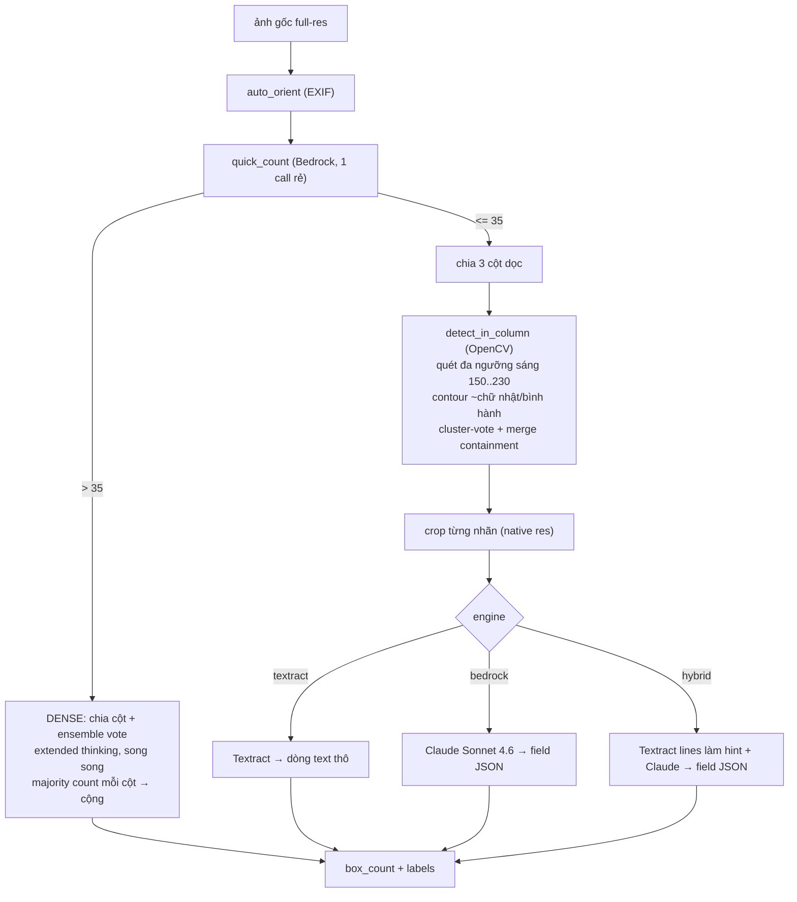

# Box Label Extractor — Python / OpenCV pipeline

Dự án Python **độc lập**: dùng **OpenCV thật** để phát hiện + cắt từng nhãn trắng trên
thùng, sau đó OCR bằng **Amazon Textract** và/hoặc **Amazon Bedrock (Claude Sonnet 4.6)**.

Khác với bản Node trong `../app` (dùng `sharp` xấp xỉ và để Claude tự đếm), bản này tách
bạch hai khâu, và **tự động chọn phương pháp đếm theo mật độ thùng**:

- **Router**: một lời gọi Bedrock rẻ (`quick_count`) ước lượng nhanh số thùng (theo nhãn
  trắng nguyên, output chỉ là con số).
- **≤ 35 thùng** → **OpenCV detect/crop** từng nhãn rồi OCR (Textract/Bedrock) ở độ phân
  giải gốc. Xác định, không tốn model cho khâu detect, độ phủ field cao nhất.
- **> 35 thùng** → **phương pháp DENSE**: chia ảnh thành cột dọc, đếm mỗi cột bằng
  extended thinking + **ensemble majority vote** (mọi lời gọi chạy song song), cộng các cột.
  Chịu được pallet xếp dày khi nhãn dính nhau làm OpenCV under-count.



## Vì sao tách detect bằng OpenCV

Claude/Bedrock **tự thu nhỏ ảnh về ~1.15 MP** trước khi nhìn, nên chữ trên nhãn nhỏ bị mờ →
bỏ sót field (time, order_number...). Nếu **OpenCV cắt riêng từng nhãn** rồi mới gửi đi OCR,
mỗi nhãn được đọc ở độ phân giải gần gốc → text rõ, đọc gần như 100% trên nhãn còn nguyên.
Nhãn rách/lệch là giới hạn vật lý (mắt người cũng phải đoán).

## Cài đặt

```bash
pip install -r requirements.txt          # opencv-python, numpy, boto3
# cần AWS profile gapv50k (region ap-southeast-1) có quyền Textract + Bedrock
```

## Dùng

```bash
# tự động chọn phương pháp theo số thùng (mặc định, ngưỡng 35)
python pipeline.py ../IMG_5816.jpeg --engine hybrid

# ép phương pháp / đổi ngưỡng
python pipeline.py ../z....jpg --method dense
python pipeline.py ../IMG_5816.jpeg --method opencv --engine textract
python pipeline.py ../IMG_5816.jpeg --threshold 40

# OCR thô từng nhãn (nhanh) / field JSON có cấu trúc
python pipeline.py ../IMG_5816.jpeg --method opencv --engine textract
python pipeline.py ../IMG_5816.jpeg --method opencv --engine bedrock

# vẽ khung nhãn đã detect ra *_annotated.jpg (chỉ khi đi nhánh opencv)
python pipeline.py ../IMG_5816.jpeg --annotate
```

Output:

```json
{
  "box_count": 31,
  "labels": [
    { "index": 1, "col": 0,
      "fields": { "shop_name": "...", "order_number": "TO-...", "time": "13:32:14",
                  "line_code": "VC9-B", "total": "9", "products": [ ... ] } }
  ]
}
```

## File

| File | Vai trò |
|------|---------|
| `detector.py` | OpenCV: `auto_orient`, `detect_in_column` (quét đa ngưỡng + cluster-vote + merge containment), `detect_labels` (cắt cột theo lỗ) |
| `counter.py` | `quick_count` (router) + `count_dense` (cắt cột theo lỗ + ensemble vote + extended thinking) |
| `holes.py` | phát hiện lỗ tròn (OpenCV) + `column_cuts_from_holes` (k-means 1D trên toạ-độ-X lỗ → ranh giới cột) |
| `ocr.py` | `textract_lines`, `bedrock_fields` (Claude Sonnet 4.6), upscale crop trước khi OCR |
| `pipeline.py` | router theo ngưỡng → opencv/dense, `ThreadPoolExecutor`, CLI, `--annotate` |
| `batch_detect.py` | benchmark detection OpenCV thuần vs ground-truth |
| `batch_count.py` | benchmark ĐẾM end-to-end có routing vs ground-truth |
| `test_router.py` | kiểm tra `quick_count` phân nhánh đúng |
| `eval_fields.py` | đo độ phủ field của hybrid trên 1 ảnh |
| `tune.py` | quét tham số detector |

## Hiệu năng

### Cắt cột theo LỖ TRÒN (cải tiến quan trọng)

Cả hai nhánh không còn cắt cột cứng 1/N. `holes.py` phát hiện các lỗ tròn (ngưỡng sáng thích
ứng + closing + kiểm tra độ tròn), rồi k-means 1D trên toạ-độ-X của lỗ để tìm ranh giới cột
THẬT, fallback về chia đều khi tín hiệu lỗ yếu. Cắt cứng 1/3 cắt ngang thùng nằm trên ranh
giới → đếm gấp đôi. Ví dụ z609303 ranh giới thật là 0.333/0.569 (cột phải rộng hơn), không
phải 0.333/0.667.

Tác động (đo được):

| ảnh | thật | trước (cắt đều) | sau (cắt theo lỗ) |
|-----|----:|----:|----:|
| z…609303 (dense) | 42 | 48 (+6) | **43 (+1)** |
| z…512641 (opencv) | 27 | 30 (+3) | **27 (0)** |
| z…634118 (detect) | 45 | 34 | **45 (0)** |
| z…505382 (detect) | 45 | 29 | 40 |
| z…611275 (detect) | 40 | 28 | 41 |

Detection thuần (OpenCV, không OCR) trên cả 12 ảnh: tổng sai số tuyệt đối **50 → 18**.

### Đếm end-to-end CÓ ROUTING (`python batch_count.py 35`)

quick_count phân nhánh, rồi opencv (≤35) hoặc dense (>35):

| ảnh | thật | quick | nhánh | cuối | lệch | giây |
|-----|----:|----:|:--|----:|----:|----:|
| IMG_5816.jpeg | 31 | 31 | opencv | 31 | 0 | 11 |
| IMG_5817.jpeg | 34 | 34 | opencv | 31 | −3 | 12 |
| IMG_5818.jpeg | 4 | 10 | opencv | 4 | 0 | 7 |
| IMG_5819.jpeg | 15 | 17 | opencv | 14 | −1 | 8 |
| IMG_5825.jpeg | 22 | 22 | opencv | 21 | −1 | 7 |
| z…505382 | 45 | 45 | dense | 43 | −2 | 139 |
| z…512641 | 27 | 27 | opencv | 30 | +3 | 8 |
| z…609303 | 42 | 41 | dense | 48 | +6 | 239 |
| z…634118 | 45 | 41 | dense | 43 | −2 | 161 |
| z…817056 | 36 | 36 | dense | 36 | 0 | 131 |
| z…874606 | 30 | 30 | opencv | 30 | 0 | 7 |
| z…611275 | 40 | 40 | dense | 38 | −2 | 137 |

**exact 4/12, tổng sai số tuyệt đối 20** (OpenCV thuần là 50). Router phân nhánh khớp 100%
với ground-truth. Nhánh opencv ~7–12s/ảnh; nhánh dense ~130–240s/ảnh (3 cột × 3 vote thinking,
song song 4 luồng). z609303 (thùng hồng, bố cục không phải 3 cột đều) là ca khó nhất.

> **Lưu ý kỹ thuật quan trọng:** nhánh dense phải dùng `converse_stream` + `read_timeout=600s`.
> Dùng `converse` (non-stream) bị **read_timeout mặc định 60s** của boto3 cắt giữa lúc model
> đang "thinking" trên ảnh dày → boto3 tự retry 5× (~5 phút) rồi trả 0, vừa cực chậm vừa sai.
> Streaming giữ kết nối sống nên 1 cột chỉ ~60–120s.

### Detection (OpenCV thuần, không OCR — `python batch_detect.py`)

Đo riêng khả năng detect của OpenCV trên MỌI ảnh (kể cả ảnh dày vốn được route sang dense):
**exact 3/12, tổng sai số ~50–60.** Ảnh điện thoại hi-res (5712×4284) gần như chính xác
(5816 đúng 31/31); ảnh `z*` (2560×1920) xếp dày 45 cái sát nhau → nhãn dính khi nhị phân hoá
nên under-count — đây chính là lý do cần nhánh dense. ~0.2–1.2s/ảnh.

### Field coverage — engine hybrid (`python eval_fields.py ../IMG_5816.jpeg hybrid`)

31 nhãn detect được, mỗi nhãn OCR ở native res:

| field | phủ |
|-------|----:|
| shop_name | 30/31 |
| order_number | 30/31 |
| time | 30/31 |
| line_code | 30/31 |
| total | 29/31 |
| number | 29/31 |
| date | 28/31 |
| products | 30/31 |
| box_code | 3/31 |

**time 30/31** (bản Node chỉ ~27) và **order_number 30/31** — cắt từng nhãn rồi OCR rõ hơn
hẳn việc đưa cả cột thu nhỏ cho model. `box_code` thấp vì mã đó in trên **carton** ngoài
nhãn, không nằm trong vùng crop nhãn (bản `app` lấy box_code ở mức cột). ~40–43s/ảnh
(Textract + Bedrock cho từng nhãn, chạy song song 8 luồng).

## So sánh với bản Node (`../app`)

| | Node `app` (sharp + Bedrock) | Python `pyapp` (OpenCV + routing) |
|---|---|---|
| Phát hiện/đếm thùng | Claude đếm theo cột (tiling + ensemble vote + thinking) | **Router**: OpenCV (≤35) hoặc dense ensemble (>35) |
| Xử lý ảnh | `sharp` (xấp xỉ, không phải OpenCV) | OpenCV thật (threshold sweep, contour, morphology) |
| OCR field | Bedrock + Textract hint ở mức **cột** | Textract/Bedrock ở mức **từng nhãn** native res |
| Đếm chính xác | 10–11/12 đúng (ảnh dày ±1–2) | exact 4/12, tổng sai số 20 (±0–3 đa số, +6 ca khó) |
| Phủ field (5816) | time ~27/31 | time 30/31, order 30/31 |
| Triển khai | Lambda + API Gateway + web S3 (online) | CLI local |
| Chi phí đếm | tốn nhiều invoke model | 0 cho ảnh ≤35 (CV); chỉ ảnh dày mới gọi model |

Hai cách bổ trợ nhau: ảnh thường thì OpenCV rẻ, xác định, nhanh (~10s, 0 chi phí model); ảnh
dày thì chuyển sang dense ensemble vote để chịu được nhãn dính. Đọc field thì cắt-nhãn-rồi-OCR
cho độ phủ cao nhất (time 30/31 so với 27/31 của bản Node).
